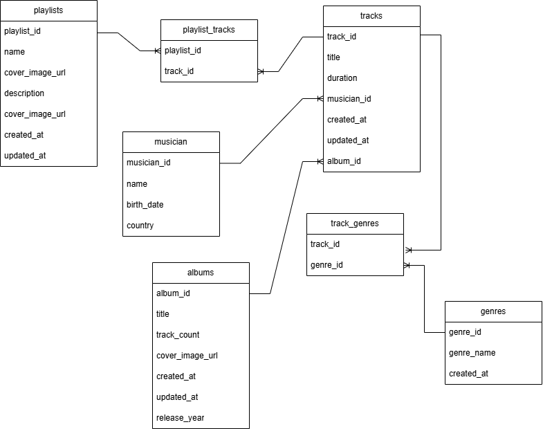

# Проектная работа по дисциплине «Базы данных».
## Этап 1: Разработка даталогической модели базы данных
#### В базе данных хранятся музыкальные произведения как сольных исполнителей, так и групп. Информация об альбомах, жанрах и плейлистах, которые пользователь может заполнять любимыми треками.

### Даталогическая модель базы данных.

### Описание таблиц
1.  Tracks: содержит информацию о музыкальном произведении, его длительность и внешние ключи на автора и альбом
2.  Genres: содержит информацию о жанре музыкального произведения (название жанра)
3.  Musicians: содержит информацию о авторе музыкального произведения, его имя (название группы), дату рождения (основания группы), страну
4.  Albums: содержит информацию об альбоме, к которому относится музыкальное произведение, хранит количество треков, обложку и дату релиза
5.  Playlists: содержит информацию о плейстисте, включает название, обложку и описание, которое добавил пользователь
6.  Playlist_tracks: таблица для связи треков и плейлистов. Один трек может быть в нескольких плейлистах одновременно, в то же время как и один плейлист может хранить несколько треков.
7.  Track_genres: таблица для связи треков и жанров. Музыкальное произведение может быть написано одновременно в нескольких жанрах, также как и в одном жанре может быть много треков.

### Триггер
Таблица tracks содержит автоматически вычисляемое при помощи треггера поле updated_at, которое автоматически обновляется при внесении каких-либо обновлений в таблицу
Таблица playlists содержит автоматически вычисляемое при помощи треггера поле updated_at, которое автоматически обновляется при внесении каких-либо обновлений в таблицу

### Ограничения на таблицах:   
1. Tracks: атрибут title не может быть пустым и должен быть уникальным, также таблица содержит внешние и первичный ключ, которые тоже являются ограничениями
2. Genres: артибут genre_name не может быть пустым и должен быть уникальным
3. Musicians: атрибут name должен быть заполнен и он не может повторяться
4. Albums: атрибуты title и track_count не должны быть пустыми, track_count обязательно должно быть >= 1. release_year должен быть больше 1800, но меньше текущей даты
5. Playlist_tracks: содержит внешние ключи, которые являются первичными для таблиц playlists и tracks
6. Track_genres: содержит внешние ключи, которые являются первичными для таблиц tracks и genres

## Этап 2: Создание базы данных в СУБД PostgreSQL. Заполнение таблиц данными. Составление осмысленных запросов к базе данных.

### Заполнение таблицы данными(код в приложении).

### 20 осмысленных запросов к базе данных(код в приложении).

##### 1. Получить все треки с их исполнителями и жанрами
##### 2. Получить все альбомы, выпущенные после 2000 года
##### 3. Найти количество треков в каждом альбоме
##### 4. Получить плейлисты с количеством треков
##### 5. Получить треки длительностью более 4 минут
##### 6. Получить исполнителей из России
##### 7. Получить все треки жанра 'Рок'
##### 8. Получить все плейлисты, созданные после 2024 года
##### 9. Вывести альбомы с обложками
##### 10. Найти все треки, не входящие ни в один плейлист
##### 11. Получить исполнителей, у которых нет ни одного трека
##### 12. Посчитать общее количество треков в базе
##### 13. Получить исполнителей и их количество треков
##### 14. Найти самый продолжительный трек
##### 15. Получить плейлист с максимальным числом треков
##### 16. Получить треки и их соответствующие альбомы
##### 17. Получить список жанров с количеством треков в каждом жанре
##### 18. Получить плейлисты с описанием и датой обновления
##### 19. Получить все треки группы 'Rammstein'
##### 20. Получить все треки, выпущенные до 2000 года

## Этап 3: Добавление индексов в базу данных и обоснование их использования. Добавление триггера, придуманного на 1 этапе и добавление 5 процедур.

```sql
CREATE INDEX idx_tracks_title 
ON tracks (title);
```
Индекс используется для поиска треков по названию. Актуален, потому что количество треков может быть огромным, все его названия являются уникальными,а поиск по имени трека очень распространен.

Таблица tracks содержит автоматически вычисляемое при помощи треггера поле updated_at, которое автоматически обновляется при внесении каких-либо обновлений в таблицу
Таблица playlists содержит автоматически вычисляемое при помощи треггера поле updated_at, которое автоматически обновляется при внесении каких-либо обновлений в таблицу
Код для создания триггеров в приложении

### Пять процедур (код в приложении)
1. Процедура для добавления нового трека
2. Процедура для удаления трека из плейлиста
3. Процедура для обновления названия плейлиста
4. Процедура для добавления нового альбома
5. Процедура для подсчёта количества треков музыканта

## Этап 4 Разработать программу для работы с вашей базой данных. (В разработке...)

## Приложение
### Создание таблиц 
```sql
CREATE TABLE musician (
    musician_id uuid PRIMARY KEY DEFAULT gen_random_uuid(),
    name VARCHAR NOT NULL UNIQUE,
    birth_date DATE, 
    country VARCHAR 
);


CREATE TABLE genres (
    genre_id uuid PRIMARY KEY DEFAULT gen_random_uuid(),
    genre_name VARCHAR NOT NULL UNIQUE,
    created_at TIMESTAMP DEFAULT CURRENT_TIMESTAMP
);


CREATE TABLE tracks (
    track_id uuid PRIMARY KEY DEFAULT gen_random_uuid(),
    title VARCHAR NOT NULL,
    duration INTERVAL,
    musician_id uuid REFERENCES musician(musician_id),
    CONSTRAINT unique_track_musician UNIQUE (title, musician_id),
   created_at TIMESTAMP DEFAULT CURRENT_TIMESTAMP,
    updated_at TIMESTAMP DEFAULT CURRENT_TIMESTAMP
);


CREATE TABLE track_genres (
    track_id uuid REFERENCES tracks(track_id) ON DELETE CASCADE,
    genre_id uuid REFERENCES genres(genre_id) ON DELETE CASCADE,
    PRIMARY KEY (track_id, genre_id)
);


CREATE TABLE playlists (
    playlist_id uuid PRIMARY KEY DEFAULT gen_random_uuid(),
    name VARCHAR NOT NULL UNIQUE,
    cover_image_url VARCHAR,
    description TEXT,
    created_at TIMESTAMP DEFAULT CURRENT_TIMESTAMP,
    updated_at TIMESTAMP DEFAULT CURRENT_TIMESTAMP
);


CREATE TABLE playlist_tracks (
    playlist_id uuid REFERENCES playlists(playlist_id) ON DELETE CASCADE,
    track_id uuid REFERENCES tracks(track_id) ON DELETE CASCADE,
    PRIMARY KEY (playlist_id, track_id)
);

CREATE TABLE albums (
    album_id uuid PRIMARY KEY DEFAULT gen_random_uuid(),
    title VARCHAR NOT NULL,
    track_count INT NOT NULL CHECK (track_count >= 1),
    cover_image_url VARCHAR,
    release_year INTEGER NOT NULL CHECK (release_year >= 1800 AND release_year <= EXTRACT(YEAR FROM CURRENT_DATE)),
    created_at TIMESTAMP DEFAULT CURRENT_TIMESTAMP,
    updated_at TIMESTAMP DEFAULT CURRENT_TIMESTAMP
);
```
### Заполнение таблиц
## Таблица Tracks
```sql
INSERT INTO tracks (title, duration, musician_id) VALUES 
('Ich Will', INTERVAL '3:37', (SELECT musician_id FROM musician WHERE name = 'Rammstein')),
('Bohemian Rhapsody', INTERVAL '5:55', (SELECT musician_id FROM musician WHERE name = 'Queen')),
('Тяни', INTERVAL '3:35', (SELECT musician_id FROM musician WHERE name = 'Король и шут')),
('Engel', INTERVAL '4:24', (SELECT musician_id FROM musician WHERE name = 'Rammstein')),
('Links 2-3-4', INTERVAL '3:36', (SELECT musician_id FROM musician WHERE name = 'Rammstein')),
('Smells Like Teen Spirit', INTERVAL '5:01', (SELECT musician_id FROM musician WHERE name = 'Nirvana')),
('Sonne', INTERVAL '4:32', (SELECT musician_id FROM musician WHERE name = 'Rammstein')),
('Come as You Are', INTERVAL '3:38', (SELECT musician_id FROM musician WHERE name = 'Nirvana')),
('Кукла колдуна', INTERVAL '4:00', (SELECT musician_id FROM musician WHERE name = 'Король и шут')),
('Времена года', INTERVAL '5:00', (SELECT musician_id FROM musician WHERE name = 'Петр Чайковский')),
('Лебединое озеро', INTERVAL '5:10', (SELECT musician_id FROM musician WHERE name = 'Петр Чайковский')),
('Amour', INTERVAL '4:49', (SELECT musician_id FROM musician WHERE name = 'Rammstein')),
('Проклятый старый дом', INTERVAL '4:20', (SELECT musician_id FROM musician WHERE name = 'Король и шут')),
('Mutter', INTERVAL '4:28', (SELECT musician_id FROM musician WHERE name = 'Rammstein')),
('I am', INTERVAL '3:50', (SELECT musician_id FROM musician WHERE name = 'Macan')),
('Владимирский централ', INTERVAL '2:30', (SELECT musician_id FROM musician WHERE name = 'Михаил Круг')),
('Щелкунчик', INTERVAL '3:05', (SELECT musician_id FROM musician WHERE name = 'Петр Чайковский')),
('Город под подошвой', INTERVAL '4:15', (SELECT musician_id FROM musician WHERE name = 'Oxxxymiron')),
('Переплетено', INTERVAL '2:40', (SELECT musician_id FROM musician WHERE name = 'Oxxxymiron')),
('Май', INTERVAL '3:55', (SELECT musician_id FROM musician WHERE name = 'Macan')),
('Неваляшка', INTERVAL '4:10', (SELECT musician_id FROM musician WHERE name = 'Oxxxymiron')),
('Mein Herz Brennt', INTERVAL '4:39', (SELECT musician_id FROM musician WHERE name = 'Rammstein')),
('In Bloom', INTERVAL '4:14', (SELECT musician_id FROM musician WHERE name = 'Nirvana')),
('Amerika', INTERVAL '3:46', (SELECT musician_id FROM musician WHERE name = 'Rammstein')),
('Du Hast', INTERVAL '3:54', (SELECT musician_id FROM musician WHERE name = 'Rammstein')),
('Here comes the Sun', INTERVAL '3:12', (SELECT musician_id FROM musician WHERE name = 'The Beatles')),
('Heart-Shaped Box', INTERVAL '4:41', (SELECT musician_id FROM musician WHERE name = 'Nirvana')),
('Там где нас нет', INTERVAL '4:25', (SELECT musician_id FROM musician WHERE name = 'Oxxxymiron')),
('Lithium', INTERVAL '4:17', (SELECT musician_id FROM musician WHERE name = 'Nirvana')),
('The Show Must Go On', INTERVAL '4:23', (SELECT musician_id FROM musician WHERE name = 'Queen')),
('Тишина', INTERVAL '2:45', (SELECT musician_id FROM musician WHERE name = 'Михаил Круг')),
('Yesterday', INTERVAL '2:33', (SELECT musician_id FROM musician WHERE name = 'The Beatles'));
```
### Таблица genres
```sql
INSERT INTO genres (genre_name) VALUES 
('Рок'),
('Рэп'),
('Классика'),
('Шансон'),
('Поп'),
('Фонк'),
('Панк-рок'),
('Дабстеп'),
('Джаз'),
('Блюз'),
('Регги'),
('Хип хоп');
```
### Таблица musicians
```sql
INSERT INTO musician (name, birth_date, country) VALUES 
('Macan', '2002-01-06', 'Россия'),
('Михаил Круг', '1962-04-07', 'Россия'),
('Oxxxymiron',  '1985-01-31', 'Россия'),
('Петр Чайковский',  '1840-05-07', 'Россия'),
('Король и шут',  '1988-01-01', 'Россия'),
('Queen', '1970-01-01', 'UK'),
('The Beatles', '1960-01-01', 'UK'),
('Little Big', '1987-01-01', 'Россия'),
('Rammstein', '1994-01-01', 'Germany'),
('Nirvana', '1960-01-01', 'USA');
```

### Таблица playlists
```sql
INSERT INTO playlists (name, cover_image_url, description) VALUES 
('My Favorite Playlist', 'https://example.com/covers/playlist_cover.jpg', 'Этот плейлист состоит из моих самых любимых треков' ),
('Для учебы', 'https://example.com/covers/playlist_cover.jpg', 'Этот плейлист состоит из моих самых любимых треков' ),
('Для тренировки в зале', 'https://example.com/covers/gym.jpg', 'Этот плейлист состоит из песен для тренировок в зале' ),
('Для прогулки', 'https://example.com/covers/walk.jpg', 'Этот плейлист состоит из песен для прогулки' ),
('Для работы', 'https://example.com/covers/work.jpg', 'Этот плейлист состоит из песен для работы' ),
('Для кулинарии', 'https://example.com/covers/cook.jpg', 'Этот плейлист состоит из песен для приготовления еды' ),
('Для пробежки', 'https://example.com/covers/run.jpg', 'Этот плейлист состоит из песен для пробежки' ),
('Музыка для путешествий', 'https://example.com/covers/travel.jpg', 'Этот плейлист состоит из песен для дальних путешествий' ),
('Для отдыха', 'https://example.com/covers/relax.jpg', 'Этот плейлист состоит из песен для отдыха' ),
('Детская музыка', 'https://example.com/covers/child.jpg', 'Этот плейлист состоит из детских песен' ),
```

### Таблица albums
```sql
INSERT INTO albums (title, track_count, cover_image_url,  release_year) VALUES
('Мадам', 17, 'https://example.com/covers/madam.jpg',  1998),
('Как в старой сказке', 17, 'https://example.com/covers/skazka.jpg',  2001),
('Акустический альбом', 18, 'https://example.com/covers/kuklaKolduna.jpg',  1990),
('I am', 21, 'https://example.com/covers/Iam.jpg',  2024),
('Горгород', 11, 'https://example.com/covers/Gorgorod.jpg',  2015),
('Nevermind', 12, 'https://example.com/covers/Nevermind.jpg',  1991),
('Mutter', 11, 'https://example.com/covers/Mutter.jpg',  2001),
('Sehnsucht', 11, 'https://example.com/covers/Sehnsucht.jpg',  1997),
('Reise, Reise', 11, 'https://example.com/covers/Reise.jpg',  2004),
('Abbey Road', 17, 'https://example.com/covers/abbey_road.jpg',  1969),
('A Night at the Opera', 17, 'https://example.com/covers/Opera.jpg', 1975);
```

### Таблица tracks_genres
```sql
INSERT INTO track_genres (track_id, genre_id) VALUES 
((SELECT track_id FROM tracks WHERE title = 'Sonne'), (SELECT genre_id FROM genres WHERE genre_name = 'Рок')),
((SELECT track_id FROM tracks WHERE title = 'Кукла колдуна'), (SELECT genre_id FROM genres WHERE genre_name = 'Рок')),
((SELECT track_id FROM tracks WHERE title = 'Кукла колдуна'), (SELECT genre_id FROM genres WHERE genre_name = 'Панк-рок')),


((SELECT track_id FROM tracks WHERE title = 'Времена года'), (SELECT genre_id FROM genres WHERE genre_name = 'Классика')),
((SELECT track_id FROM tracks WHERE title = 'Лебединое озеро'), (SELECT genre_id FROM genres WHERE genre_name = 'Классика')),
((SELECT track_id FROM tracks WHERE title = 'Проклятый старый дом'), (SELECT genre_id FROM genres WHERE genre_name = 'Рок')),
((SELECT track_id FROM tracks WHERE title = 'Проклятый старый дом'), (SELECT genre_id FROM genres WHERE genre_name = 'Панк-рок')),
((SELECT track_id FROM tracks WHERE title = 'I am'), (SELECT genre_id FROM genres WHERE genre_name = 'Хип хоп')),
((SELECT track_id FROM tracks WHERE title = 'I am'), (SELECT genre_id FROM genres WHERE genre_name = 'Рэп')),

((SELECT track_id FROM tracks WHERE title = 'Владимирский централ'), (SELECT genre_id FROM genres WHERE genre_name = 'Шансон')),
((SELECT track_id FROM tracks WHERE title = 'Щелкунчик'), (SELECT genre_id FROM genres WHERE genre_name = 'Классика')),
((SELECT track_id FROM tracks WHERE title = 'Город под подошвой'), (SELECT genre_id FROM genres WHERE genre_name = 'Рэп')),
((SELECT track_id FROM tracks WHERE title = 'Переплетено'), (SELECT genre_id FROM genres WHERE genre_name = 'Рэп')),
((SELECT track_id FROM tracks WHERE title = 'Май'), (SELECT genre_id FROM genres WHERE genre_name = 'Хип хоп')),
((SELECT track_id FROM tracks WHERE title = 'Май'), (SELECT genre_id FROM genres WHERE genre_name = 'Рэп')),
((SELECT track_id FROM tracks WHERE title = 'Неваляшка'), (SELECT genre_id FROM genres WHERE genre_name = 'Рэп')),
((SELECT track_id FROM tracks WHERE title = 'Тяни'), (SELECT genre_id FROM genres WHERE genre_name = 'Рок')),
((SELECT track_id FROM tracks WHERE title = 'Тяни'), (SELECT genre_id FROM genres WHERE genre_name = 'Панк-рок')),


((SELECT track_id FROM tracks WHERE title = 'Amerika'), (SELECT genre_id FROM genres WHERE genre_name = 'Рок')),
((SELECT track_id FROM tracks WHERE title = 'Du Hast'), (SELECT genre_id FROM genres WHERE genre_name = 'Рок')),
((SELECT track_id FROM tracks WHERE title = 'Here comes the Sun'), (SELECT genre_id FROM genres WHERE genre_name = 'Рок')),
((SELECT track_id FROM tracks WHERE title = 'Heart-Shaped Box'), (SELECT genre_id FROM genres WHERE genre_name = 'Рок')),
((SELECT track_id FROM tracks WHERE title = 'Там где нас нет'), (SELECT genre_id FROM genres WHERE genre_name = 'Рэп')),
((SELECT track_id FROM tracks WHERE title = 'Lithium'), (SELECT genre_id FROM genres WHERE genre_name = 'Рок')),
((SELECT track_id FROM tracks WHERE title = 'Lithium'), (SELECT genre_id FROM genres WHERE genre_name = 'Панк-рок')),
((SELECT track_id FROM tracks WHERE title = 'The Show Must Go On'), (SELECT genre_id FROM genres WHERE genre_name = 'Рок')),
((SELECT track_id FROM tracks WHERE title = 'Тишина'), (SELECT genre_id FROM genres WHERE genre_name = 'Шансон')),


((SELECT track_id FROM tracks WHERE title = 'Engel'), (SELECT genre_id FROM genres WHERE genre_name = 'Рок')),
((SELECT track_id FROM tracks WHERE title = 'Links 2-3-4'), (SELECT genre_id FROM genres WHERE genre_name = 'Рок')),
((SELECT track_id FROM tracks WHERE title = 'Smells Like Teen Spirit'), (SELECT genre_id FROM genres WHERE genre_name = 'Рок')),
((SELECT track_id FROM tracks WHERE title = 'Smells Like Teen Spirit'), (SELECT genre_id FROM genres WHERE genre_name = 'Панк-рок')),
((SELECT track_id FROM tracks WHERE title = 'Come as You Are'), (SELECT genre_id FROM genres WHERE genre_name = 'Рок')),
((SELECT track_id FROM tracks WHERE title = 'Come as You Are'), (SELECT genre_id FROM genres WHERE genre_name = 'Панк-рок'));
((SELECT track_id FROM tracks WHERE title = 'Amour'), (SELECT genre_id FROM genres WHERE genre_name = 'Рок')),
((SELECT track_id FROM tracks WHERE title = 'Mutter'), (SELECT genre_id FROM genres WHERE genre_name = 'Рок')),
((SELECT track_id FROM tracks WHERE title = 'Mein Herz Brennt'), (SELECT genre_id FROM genres WHERE genre_name = 'Рок')),
((SELECT track_id FROM tracks WHERE title = 'In Bloom'), (SELECT genre_id FROM genres WHERE genre_name = 'Рок')),
((SELECT track_id FROM tracks WHERE title = 'In Bloom'), (SELECT genre_id FROM genres WHERE genre_name = 'Панк-рок')),
((SELECT track_id FROM tracks WHERE title = 'Yesterday  '), (SELECT genre_id FROM genres WHERE genre_name = 'Рок'));
```

### Таблица tracks_playlists
```sql
INSERT INTO playlist_tracks (playlist_id, track_id)
VALUES
    -- Плейлист 1
    ((SELECT playlist_id FROM playlists WHERE name = 'Мой самый любимый плейлист'), (SELECT track_id FROM tracks WHERE title = 'Sonne')),
    ((SELECT playlist_id FROM playlists WHERE name = 'Мой самый любимый плейлист'), (SELECT track_id FROM tracks WHERE title = 'Кукла колдуна')),
    ((SELECT playlist_id FROM playlists WHERE name = 'Мой самый любимый плейлист'), (SELECT track_id FROM tracks WHERE title = 'Времена года')),
    ((SELECT playlist_id FROM playlists WHERE name = 'Мой самый любимый плейлист'), (SELECT track_id FROM tracks WHERE title = 'Лебединое озеро')),
    ((SELECT playlist_id FROM playlists WHERE name = 'Мой самый любимый плейлист'), (SELECT track_id FROM tracks WHERE title = 'Проклятый старый дом')),
    ((SELECT playlist_id FROM playlists WHERE name = 'Мой самый любимый плейлист'), (SELECT track_id FROM tracks WHERE title = 'I am')),

      Плейлист 2
    ((SELECT playlist_id FROM playlists WHERE name = 'Для пробежки'), (SELECT track_id FROM tracks WHERE title = 'Come as You Are')),
    ((SELECT playlist_id FROM playlists WHERE name = 'Для пробежки'), (SELECT track_id FROM tracks WHERE title = 'Links 2-3-4')),
    ((SELECT playlist_id FROM playlists WHERE name = 'Для пробежки'), (SELECT track_id FROM tracks WHERE title = 'Там где нас нет')),


      Плейлист 3
    ((SELECT playlist_id FROM playlists WHERE name = 'Для прогулки'), (SELECT track_id FROM tracks WHERE title = 'Mutter')),
    ((SELECT playlist_id FROM playlists WHERE name = 'Для прогулки'), (SELECT track_id FROM tracks WHERE title = 'Лебединое озеро')),
    ((SELECT playlist_id FROM playlists WHERE name = 'Для прогулки'), (SELECT track_id FROM tracks WHERE title = 'In Bloom')),
    ((SELECT playlist_id FROM playlists WHERE name = 'Для прогулки'), (SELECT track_id FROM tracks WHERE title = 'Город под подошвой')),
    ((SELECT playlist_id FROM playlists WHERE name = 'Для прогулки'), (SELECT track_id FROM tracks WHERE title = 'Май')),
    ((SELECT playlist_id FROM playlists WHERE name = 'Для прогулки'), (SELECT track_id FROM tracks WHERE title = 'Щелкунчик')),

      Плейлист 4
    ((SELECT playlist_id FROM playlists WHERE name = 'Для отдыха'), (SELECT track_id FROM tracks WHERE title = 'Лебединое озеро')),
    ((SELECT playlist_id FROM playlists WHERE name = 'Для отдыха'), (SELECT track_id FROM tracks WHERE title = 'Щелкунчик')),
   

      -- Плейлист 5
    ((SELECT playlist_id FROM playlists WHERE name = 'Для учебы'), (SELECT track_id FROM tracks WHERE title = 'Sonne')),
    ((SELECT playlist_id FROM playlists WHERE name = 'Для учебы'), (SELECT track_id FROM tracks WHERE title = 'Yesterday')),
    ((SELECT playlist_id FROM playlists WHERE name = 'Для учебы'), (SELECT track_id FROM tracks WHERE title = 'Ich Will')),
    ((SELECT playlist_id FROM playlists WHERE name = 'Для учебы'), (SELECT track_id FROM tracks WHERE title = 'Владимирский централ')),
    ((SELECT playlist_id FROM playlists WHERE name = 'Для учебы'), (SELECT track_id FROM tracks WHERE title = 'Проклятый старый дом')),
    ((SELECT playlist_id FROM playlists WHERE name = 'Для учебы'), (SELECT track_id FROM tracks WHERE title = 'Тяни')),

      Плейлист 6
    ((SELECT playlist_id FROM playlists WHERE name = 'Для тренировки в зале'), (SELECT track_id FROM tracks WHERE title = 'Тишина')),
    ((SELECT playlist_id FROM playlists WHERE name = 'Для тренировки в зале'), (SELECT track_id FROM tracks WHERE title = 'Engel')),
    ((SELECT playlist_id FROM playlists WHERE name = 'Для тренировки в зале'), (SELECT track_id FROM tracks WHERE title = 'Времена года')),
    ((SELECT playlist_id FROM playlists WHERE name = 'Для тренировки в зале'), (SELECT track_id FROM tracks WHERE title = 'Amour')),


      Плейлист 7
    ((SELECT playlist_id FROM playlists WHERE name = 'Детская музыка'), (SELECT track_id FROM tracks WHERE title = 'Mutter')),
    ((SELECT playlist_id FROM playlists WHERE name = 'Детская музыка'), (SELECT track_id FROM tracks WHERE title = 'Щелкунчик')),
    ((SELECT playlist_id FROM playlists WHERE name = 'Детская музыка'), (SELECT track_id FROM tracks WHERE title = 'Времена года')),
    ((SELECT playlist_id FROM playlists WHERE name = 'Детская музыка'), (SELECT track_id FROM tracks WHERE title = 'Лебединое озеро')),
    ((SELECT playlist_id FROM playlists WHERE name = 'Детская музыка'), (SELECT track_id FROM tracks WHERE title = 'Времена года')),
    ((SELECT playlist_id FROM playlists WHERE name = 'Детская музыка'), (SELECT track_id FROM tracks WHERE title = 'I am')),

      -- Плейлист 8
    ((SELECT playlist_id FROM playlists WHERE name = 'Музыка для путешествий'), (SELECT track_id FROM tracks WHERE title = 'Владимирский централ')),
   

      -- Плейлист 9
    ((SELECT playlist_id FROM playlists WHERE name = 'Для кулинарии'), (SELECT track_id FROM tracks WHERE title = 'Неваляшка')),
    ((SELECT playlist_id FROM playlists WHERE name = 'Для кулинарии'), (SELECT track_id FROM tracks WHERE title = 'Май')),
    ((SELECT playlist_id FROM playlists WHERE name = 'Для кулинарии'), (SELECT track_id FROM tracks WHERE title = 'Времена года')),

      -- Плейлист 10
    ((SELECT playlist_id FROM playlists WHERE name = 'Для работы'), (SELECT track_id FROM tracks WHERE title = 'Тяни')),
    ((SELECT playlist_id FROM playlists WHERE name = 'Для работы'), (SELECT track_id FROM tracks WHERE title = 'In Bloom')),
    ((SELECT playlist_id FROM playlists WHERE name = 'Для работы'), (SELECT track_id FROM tracks WHERE title = 'Переплетено'));

```

### Осмысленные запросы

1. Получить все треки с их исполнителями и жанрами
   
```sql
SELECT t.title AS track_title, m.name AS musician_name, g.genre_name
FROM tracks t
JOIN musician m ON t.musician_id = m.musician_id
JOIN track_genres tg ON t.track_id = tg.track_id
JOIN genres g ON tg.genre_id = g.genre_id;
```

2. Получить все альбомы, выпущенные после 2000 года
   
```sql
SELECT title, release_year 
FROM albums 
WHERE release_year > 2000;
```

3. Найти количество треков в каждом альбоме
   
```sql
SELECT a.title AS album_title, COUNT(t.track_id) AS track_count
FROM albums a
LEFT JOIN tracks t ON a.album_id = t.album_id
GROUP BY a.album_id, a.title;
```

4. Получить плейлисты с количеством треков
```sql
SELECT p.name AS playlist_name, COUNT(pt.track_id) AS track_count
FROM playlists p
LEFT JOIN playlist_tracks pt ON p.playlist_id = pt.playlist_id
GROUP BY p.playlist_id, p.name;
```

5. Получить треки длительностью более 4 минут

```sql
SELECT title, duration 
FROM tracks 
WHERE duration > '04:00:00';
```

6. Получить исполнителей из России
   
```sql
SELECT name, birth_date 
FROM musician 
WHERE country = 'Россия';
```

7. Получить все треки жанра 'Рок'
   
```sql
SELECT t.title AS track_title, m.name AS musician_name
FROM tracks t
JOIN track_genres tg ON t.track_id = tg.track_id
JOIN genres g ON tg.genre_id = g.genre_id
JOIN musician m ON t.musician_id = m.musician_id
WHERE g.genre_name = 'Рок';
```

8. Получить все плейлисты, созданные после 2024 года
   
```sql
SELECT name, created_at 
FROM playlists 
WHERE created_at >= '2024-01-01';
```

9. Вывести альбомы с обложками

```sql
SELECT title, cover_image_url 
FROM albums 
WHERE cover_image_url IS NOT NULL;
```

10. Найти все треки, не входящие ни в один плейлист'
    
```sql
SELECT t.title 
FROM tracks t
LEFT JOIN playlist_tracks pt ON t.track_id = pt.track_id
WHERE pt.track_id IS NULL;
```

11. Получить исполнителей, у которых нет ни одного трека

```sql
SELECT m.name 
FROM musician m
LEFT JOIN tracks t ON m.musician_id = t.musician_id
WHERE t.track_id IS NULL;
```

12. Посчитать общее количество треков в базе

```sql
SELECT COUNT(*) AS total_tracks 
FROM tracks;
```

13. Получить исполнителей и их количество треков

```sql
SELECT m.name, COUNT(t.track_id) AS track_count
FROM musician m
LEFT JOIN tracks t ON m.musician_id = t.musician_id
GROUP BY m.name;
```

14. Найти самый продолжительный трек

```sql
SELECT title, duration 
FROM tracks 
ORDER BY duration DESC 
LIMIT 1;
```

15. Получить плейлист с максимальным числом треков

```sql
SELECT p.name AS playlist_name, COUNT(pt.track_id) AS track_count
FROM playlists p
LEFT JOIN playlist_tracks pt ON p.playlist_id = pt.playlist_id
GROUP BY p.playlist_id, p.name
ORDER BY track_count DESC 
LIMIT 1;
```

16. Получить треки и их соответствующие альбомы

```sql
SELECT t.title AS track_title, a.title AS album_title
FROM tracks t
LEFT JOIN albums a ON t.album_id = a.album_id;
```

17. Получить список жанров с количеством треков в каждом жанре

```sql
SELECT g.genre_name, COUNT(tg.track_id) AS track_count
FROM genres g
LEFT JOIN track_genres tg ON g.genre_id = tg.genre_id
GROUP BY g.genre_name;
```

18. Получить плейлисты с описанием и датой обновления

```sql
SELECT name, description, updated_at 
FROM playlists;
```

19. Получить все треки группы 'Rammstein'

```sql
SELECT t.title, t.duration 
FROM tracks t
JOIN musician m ON t.musician_id = m.musician_id
WHERE m.name = 'Rammstein';
```

20. Получить все треки, выпущенные до 2000 года

```sql
SELECT t.title, a.title AS album_title, a.release_year
FROM tracks t
JOIN albums a ON t.album_id = a.album_id
WHERE a.release_year < 2000;
```

### Создание триггеров, для обновления updated_at

```sql
CREATE OR REPLACE FUNCTION update_playlist_track_on_change()
RETURNS TRIGGER AS $$
BEGIN
    NEW.updated_at := CURRENT_TIMESTAMP;
    RETURN NEW;
END;
$$ LANGUAGE plpgsql;


CREATE TRIGGER update_playlist_on_change_trigger
BEFORE UPDATE ON playlists
FOR EACH ROW
WHEN (OLD.* IS DISTINCT FROM NEW.*) -- Обновляем только если данные действительно изменились
EXECUTE FUNCTION update_playlist_track_on_change();


CREATE TRIGGER update_track_on_change_trigger
BEFORE UPDATE ON tracks
FOR EACH ROW
WHEN (OLD.* IS DISTINCT FROM NEW.*) -- Обновляем только если данные действительно изменились
EXECUTE FUNCTION update_playlist_track_on_change();
```

### Добавление процедур

1. Процедура для добавления нового трека

```sql
CREATE OR REPLACE PROCEDURE add_new_track(
    IN p_title VARCHAR,
    IN p_duration VARCHAR,
    IN p_musician_id UUID,
    IN p_album_id UUID
)
LANGUAGE plpgsql
AS $$
BEGIN
    INSERT INTO tracks (title, duration, musician_id, album_id, created_at, updated_at)
    VALUES (p_title, p_duration, p_musician_id, p_album_id, CURRENT_TIMESTAMP, CURRENT_TIMESTAMP);
END;
$$;
```

Пример использования
```sql
CALL add_new_track('Организация', '03:26', 'a9706fc7-4282-422e-aac0-93382702f138', null );
```

2. Процедура для удаления трека из плейлиста

```sql
CREATE OR REPLACE PROCEDURE remove_track_from_playlist(
    IN p_playlist_id UUID,
    IN p_track_id UUID
)
LANGUAGE plpgsql
AS $$
BEGIN
    DELETE FROM playlist_tracks
    WHERE playlist_id = p_playlist_id AND track_id = p_track_id;
END;
$$;
```
Пример использования
```sql
CALL remove_track_from_playlist('16300c61-0409-4a47-b5ea-3464c87d9e96', '000f59e5-3c45-4d07-a66e-a2e3e8770161');

```

3. Процедура для обновления названия плейлиста

```sql
CREATE OR REPLACE PROCEDURE update_playlist_name(
    IN p_playlist_id UUID,
    IN p_new_name VARCHAR
)
LANGUAGE plpgsql
AS $$
BEGIN
    UPDATE playlists
    SET name = p_new_name, updated_at = CURRENT_TIMESTAMP
    WHERE playlist_id = p_playlist_id;
END;
$$;
```

Пример использования
```sql
CALL update_playlist_name('16300c61-0409-4a47-b5ea-3464c87d9e96', 'Это мой самый любимый плейлист');
```

4. Процедура для добавления нового альбома

```sql
CREATE OR REPLACE PROCEDURE add_new_album(
    IN p_title VARCHAR,
    IN p_track_count INTEGER,
    IN p_cover_image_url VARCHAR,
    IN p_release_year INTEGER
)
LANGUAGE plpgsql
AS $$
BEGIN
    INSERT INTO albums (title, track_count, cover_image_url, release_year, created_at, updated_at)
    VALUES (p_title, p_track_count, p_cover_image_url, p_release_year, CURRENT_TIMESTAMP, CURRENT_TIMESTAMP);
END;
$$;
```

Пример использования
```sql
CALL add_new_album('Thriller', 9, 'https://example.com/Thriller.jpg', 1982);
```

5. Процедура для подсчёта количества треков музыканта

```sql
CREATE OR REPLACE PROCEDURE count_tracks_by_musician(
    IN p_musician_name VARCHAR,
    OUT track_count INTEGER
)
LANGUAGE plpgsql
AS $$
BEGIN
    SELECT COUNT(*) INTO track_count
    FROM tracks t
    JOIN musician m ON t.musician_id = m.musician_id
    WHERE m.name = p_musician_name;
END;
$$;

```

Пример использования
```sql
CALL count_tracks_by_musician('Rammstein', NULL);
```
